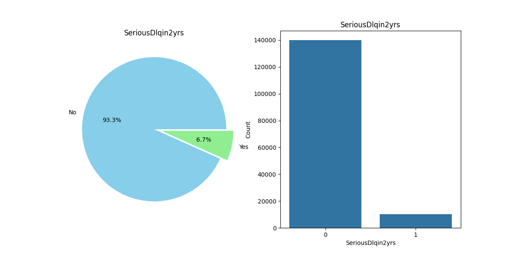
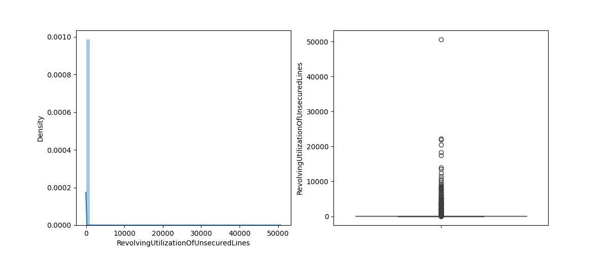
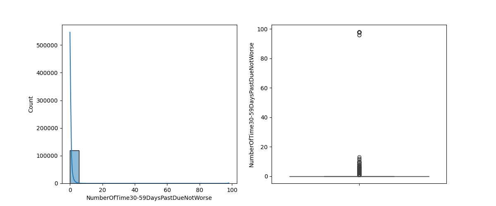
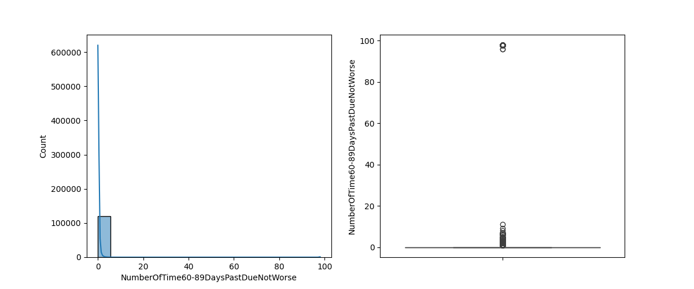
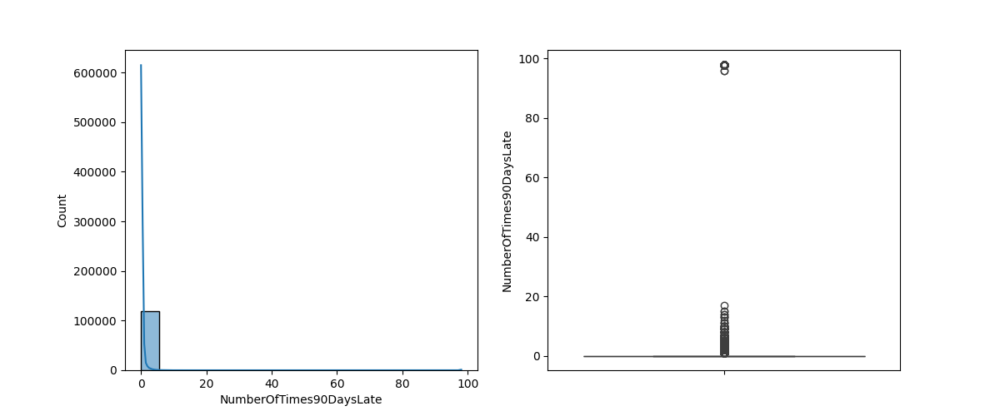

### Business Context - Banks are primarily known for money lending business. The more money they lend to people whom they can get good interest with timely repayment, the more revenue is for the banks.
* **
* The more banks are able to identify borrowers going towards serious delinquency rate, the better will be the bank's money lending business which in turn will lead to better revenue and better image in the market and with respect to competitiors. 
* **
* * **Delinquent** in general is a slightly mild term where a borrower is not repaying charges and is behind by certain months whereas * **Default** is a term where a borrower has not been able to pay charges and is behind for a long period of months and is unlikely to repay the charges.
* **
* We have a general profile about the borrower such as age, Monthly Income, Dependents and the historical data such as what is the Debt Ratio, what ratio of amount is owed wrt credit limit, and the no of times defaulted in the past one, two, three months.
* We will be using all these features to predict whether the borrower is likely to delinquent in the next 2 years or not.
* These kind of predictions will help banks to take necessary actions.

***
* **Objective** : Building a model using the inputs/attributes which are general profile and historical records of a borrower to predict whether one is likely to have serious delinquency in the next 2 years 


## Data Analysis: 


### SeriousDlqin2yrs Count Plot:


### Explanation:
- The pie chart on the left shows the proportion of borrowers who have and haven't experienced serious delinquency in the past two years.
- The count plot on the right shows the count of borrowers in each category of serious delinquency.
- The pie chart uses two colors, sky blue for 'No' and light green for 'Yes', with the 'Yes' slice exploded slightly for emphasis.
- The count plot is generated using the Seaborn library for a simple and clear representation of the count of each category.

6.683999999999999% of the borrrowers are failing in Serious Delinquency</p>


## Dataset Statistical Distribution


<table border="1" class="dataframe">
  <thead>
    <tr style="text-align: right;">
      <th></th>
      <th>SeriousDlqin2yrs</th>
      <th>RevolvingUtilizationOfUnsecuredLines</th>
      <th>age</th>
      <th>NumberOfTime30-59DaysPastDueNotWorse</th>
      <th>DebtRatio</th>
      <th>MonthlyIncome</th>
      <th>NumberOfOpenCreditLinesAndLoans</th>
      <th>NumberOfTimes90DaysLate</th>
      <th>NumberRealEstateLoansOrLines</th>
      <th>NumberOfTime60-89DaysPastDueNotWorse</th>
      <th>NumberOfDependents</th>
    </tr>
  </thead>
  <tbody>
    <tr>
      <th>count</th>
      <td>150000.000000</td>
      <td>150000.000000</td>
      <td>150000.000000</td>
      <td>150000.000000</td>
      <td>150000.000000</td>
      <td>1.202690e+05</td>
      <td>150000.000000</td>
      <td>150000.000000</td>
      <td>150000.000000</td>
      <td>150000.000000</td>
      <td>146076.000000</td>
    </tr>
    <tr>
      <th>mean</th>
      <td>0.066840</td>
      <td>6.048438</td>
      <td>52.295207</td>
      <td>0.421033</td>
      <td>353.005076</td>
      <td>6.670221e+03</td>
      <td>8.452760</td>
      <td>0.265973</td>
      <td>1.018240</td>
      <td>0.240387</td>
      <td>0.757222</td>
    </tr>
    <tr>
      <th>std</th>
      <td>0.249746</td>
      <td>249.755371</td>
      <td>14.771866</td>
      <td>4.192781</td>
      <td>2037.818523</td>
      <td>1.438467e+04</td>
      <td>5.145951</td>
      <td>4.169304</td>
      <td>1.129771</td>
      <td>4.155179</td>
      <td>1.115086</td>
    </tr>
    <tr>
      <th>min</th>
      <td>0.000000</td>
      <td>0.000000</td>
      <td>0.000000</td>
      <td>0.000000</td>
      <td>0.000000</td>
      <td>0.000000e+00</td>
      <td>0.000000</td>
      <td>0.000000</td>
      <td>0.000000</td>
      <td>0.000000</td>
      <td>0.000000</td>
    </tr>
    <tr>
      <th>25%</th>
      <td>0.000000</td>
      <td>0.029867</td>
      <td>41.000000</td>
      <td>0.000000</td>
      <td>0.175074</td>
      <td>3.400000e+03</td>
      <td>5.000000</td>
      <td>0.000000</td>
      <td>0.000000</td>
      <td>0.000000</td>
      <td>0.000000</td>
    </tr>
    <tr>
      <th>50%</th>
      <td>0.000000</td>
      <td>0.154181</td>
      <td>52.000000</td>
      <td>0.000000</td>
      <td>0.366508</td>
      <td>5.400000e+03</td>
      <td>8.000000</td>
      <td>0.000000</td>
      <td>1.000000</td>
      <td>0.000000</td>
      <td>0.000000</td>
    </tr>
    <tr>
      <th>75%</th>
      <td>0.000000</td>
      <td>0.559046</td>
      <td>63.000000</td>
      <td>0.000000</td>
      <td>0.868254</td>
      <td>8.249000e+03</td>
      <td>11.000000</td>
      <td>0.000000</td>
      <td>2.000000</td>
      <td>0.000000</td>
      <td>1.000000</td>
    </tr>
    <tr>
      <th>max</th>
      <td>1.000000</td>
      <td>50708.000000</td>
      <td>109.000000</td>
      <td>98.000000</td>
      <td>329664.000000</td>
      <td>3.008750e+06</td>
      <td>58.000000</td>
      <td>98.000000</td>
      <td>54.000000</td>
      <td>98.000000</td>
      <td>20.000000</td>
    </tr>
  </tbody>
</table>
</div>


## Separating the Dataset into Train-Test Split

```python
X = df.drop(columns = ['SeriousDlqin2yrs'], axis=1)
y = df['SeriousDlqin2yrs']
```

## Shape of Train Dataset , Test Dataset
 ###   (120000, 11) , (30000, 11)


## Univariate Analysis using Training Numerical Dataset


    


skewness :  100.53820302006339
kurtosis :  15559.574874151434




skewness :  22.560050047962374
kurtosis :  520.586140091868




skewness :  23.393598377179494
kurtosis :  548.632426633495



skewness :  23.155584699487473
kurtosis :  540.8745184818808


## DISTRIBUTION OF DATA FOR SKEWNESS AND KURTOSIS

<table border="1" class="dataframe">
  <thead>
    <tr style="text-align: right;">
      <th></th>
      <th>Skewness</th>
      <th>Kurtosis</th>
    </tr>
  </thead>
  <tbody>
    <tr>
      <th>MonthlyIncome</th>
      <td>122.587602</td>
      <td>21861.235155</td>
    </tr>
    <tr>
      <th>RevolvingUtilizationOfUnsecuredLines</th>
      <td>100.538203</td>
      <td>15559.574874</td>
    </tr>
    <tr>
      <th>DebtRatio</th>
      <td>99.142824</td>
      <td>14370.263366</td>
    </tr>
    <tr>
      <th>NumberOfTime60-89DaysPastDueNotWorse</th>
      <td>23.393598</td>
      <td>548.632427</td>
    </tr>
    <tr>
      <th>NumberOfTimes90DaysLate</th>
      <td>23.155585</td>
      <td>540.874518</td>
    </tr>
    <tr>
      <th>NumberOfTime30-59DaysPastDueNotWorse</th>
      <td>22.656445</td>
      <td>525.179814</td>
    </tr>
    <tr>
      <th>NumberRealEstateLoansOrLines</th>
      <td>3.752641</td>
      <td>71.087650</td>
    </tr>
    <tr>
      <th>NumberOfDependents</th>
      <td>1.598556</td>
      <td>3.178548</td>
    </tr>
    <tr>
      <th>NumberOfOpenCreditLinesAndLoans</th>
      <td>1.228632</td>
      <td>3.178869</td>
    </tr>
    <tr>
      <th>age</th>
      <td>0.186196</td>
      <td>-0.498428</td>
    </tr>
  </tbody>
</table>
</div>


