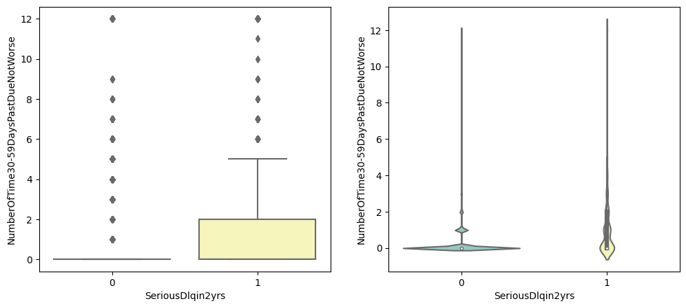

# Analysis On Default Credit Case Study


***
## Business Context - Banks primarily thrive on their money lending business. The more efficiently they can lend to individuals who repay with good interest, the better their revenue.
* **


### Objective : Building a model using the inputs/attributes which are general profile and historical records of a borrower to predict whether one is likely to have serious delinquency in the next 2 years 
* **
### Key Objectives:

Identify borrowers likely to face serious delinquency.
Enhance the bank's revenue and reputation by minimizing defaults.
* **
* * **Delinquent** in general is a slightly mild term where a borrower is not repaying charges and is behind by certain months whereas
* * **Default** is a term where a borrower has not been able to pay charges and is behind for a long period of months and is unlikely to repay the charges.
* **
* We have a general profile about the borrower such as age, Monthly Income, Dependents and the historical data such as what is the Debt Ratio, what ratio of amount is owed wrt credit limit, and the no of times defaulted in the past one, two, three months.
* We will be using all these features to predict whether the borrower is likely to delinquent in the next 2 years or not.
* These kind of predictions will help banks to take necessary actions.

***


## Table of Contents

1. [Introduction](#introduction)
2. [Business Context](#business-context)
3. [Data Analysis](#Exploratory-DataAnalysis)
   
   - [SeriousDlqin2yrs Count Plot](#seriousdlqin2yrs-count-plot)
   - [Dataset Statistical Distribution](#dataset-statistical-distribution)
   - [Univariate Analysis using Training Numerical Dataset](#univariate-analysis-using-training-numerical-dataset)
   - [Distribution of Data for Skewness and Kurtosis](#distribution-of-data-for-skewness-and-kurtosis)
   - [Bivariate Analysis](#bivariate-analysis)
     
5. [Feature Engineering](#Feature-Engineering)
6. [Class Imbalance Problem](#class-imbalance-problem)
7. [Scaling](#Scaling)
8. [Machine Learning Models](#machine-learning-models)
9. [Predictions](#Predictions)
# Dataset Table


<table border="1" class="dataframe">
  <thead>
    <tr style="text-align: right;">
      <th></th>
      <th>SeriousDlqin2yrs</th>
      <th>RevolvingUtilizationOfUnsecuredLines</th>
      <th>age</th>
      <th>NumberOfTime30-59DaysPastDueNotWorse</th>
      <th>DebtRatio</th>
      <th>MonthlyIncome</th>
      <th>NumberOfOpenCreditLinesAndLoans</th>
      <th>NumberOfTimes90DaysLate</th>
      <th>NumberRealEstateLoansOrLines</th>
      <th>NumberOfTime60-89DaysPastDueNotWorse</th>
      <th>NumberOfDependents</th>
    </tr>
  </thead>
  <tbody>
    <tr>
      <th>0</th>
      <td>1</td>
      <td>0.766127</td>
      <td>45</td>
      <td>2</td>
      <td>0.802982</td>
      <td>9120.0</td>
      <td>13</td>
      <td>0</td>
      <td>6</td>
      <td>0</td>
      <td>2.0</td>
    </tr>
    <tr>
      <th>1</th>
      <td>0</td>
      <td>0.957151</td>
      <td>40</td>
      <td>0</td>
      <td>0.121876</td>
      <td>2600.0</td>
      <td>4</td>
      <td>0</td>
      <td>0</td>
      <td>0</td>
      <td>1.0</td>
    </tr>
    <tr>
      <th>2</th>
      <td>0</td>
      <td>0.658180</td>
      <td>38</td>
      <td>1</td>
      <td>0.085113</td>
      <td>3042.0</td>
      <td>2</td>
      <td>1</td>
      <td>0</td>
      <td>0</td>
      <td>0.0</td>
    </tr>
    <tr>
      <th>3</th>
      <td>0</td>
      <td>0.233810</td>
      <td>30</td>
      <td>0</td>
      <td>0.036050</td>
      <td>3300.0</td>
      <td>5</td>
      <td>0</td>
      <td>0</td>
      <td>0</td>
      <td>0.0</td>
    </tr>
    <tr>
      <th>4</th>
      <td>0</td>
      <td>0.907239</td>
      <td>49</td>
      <td>1</td>
      <td>0.024926</td>
      <td>63588.0</td>
      <td>7</td>
      <td>0</td>
      <td>1</td>
      <td>0</td>
      <td>0.0</td>
    </tr>
    <tr>
      <th>5</th>
      <td>0</td>
      <td>0.213179</td>
      <td>74</td>
      <td>0</td>
      <td>0.375607</td>
      <td>3500.0</td>
      <td>3</td>
      <td>0</td>
      <td>1</td>
      <td>0</td>
      <td>1.0</td>
    </tr>
    <tr>
      <th>6</th>
      <td>0</td>
      <td>0.305682</td>
      <td>57</td>
      <td>0</td>
      <td>5710.000000</td>
      <td>NaN</td>
      <td>8</td>
      <td>0</td>
      <td>3</td>
      <td>0</td>
      <td>0.0</td>
    </tr>
    <tr>
      <th>7</th>
      <td>0</td>
      <td>0.754464</td>
      <td>39</td>
      <td>0</td>
      <td>0.209940</td>
      <td>3500.0</td>
      <td>8</td>
      <td>0</td>
      <td>0</td>
      <td>0</td>
      <td>0.0</td>
    </tr>
    <tr>
      <th>8</th>
      <td>0</td>
      <td>0.116951</td>
      <td>27</td>
      <td>0</td>
      <td>46.000000</td>
      <td>NaN</td>
      <td>2</td>
      <td>0</td>
      <td>0</td>
      <td>0</td>
      <td>NaN</td>
    </tr>
    <tr>
      <th>9</th>
      <td>0</td>
      <td>0.189169</td>
      <td>57</td>
      <td>0</td>
      <td>0.606291</td>
      <td>23684.0</td>
      <td>9</td>
      <td>0</td>
      <td>4</td>
      <td>0</td>
      <td>2.0</td>
    </tr>
  </tbody>
</table>
</div>


# Exploratory Data Analysis: 


### SeriousDlqin2yrs Count Plot:


### Explanation:
- The pie chart on the left shows the proportion of borrowers who have and haven't experienced serious delinquency in the past two years.
- The count plot on the right shows the count of borrowers in each category of serious delinquency.
- The pie chart uses two colors, sky blue for 'No' and light green for 'Yes', with the 'Yes' slice exploded slightly for emphasis.
- The count plot is generated using the Seaborn library for a simple and clear representation of the count of each category.

6.683999999999999% of the borrrowers are failing in Serious Delinquency</p>


## Dataset Statistical Distribution


<table border="1" class="dataframe">
  <thead>
    <tr style="text-align: right;">
      <th></th>
      <th>SeriousDlqin2yrs</th>
      <th>RevolvingUtilizationOfUnsecuredLines</th>
      <th>age</th>
      <th>NumberOfTime30-59DaysPastDueNotWorse</th>
      <th>DebtRatio</th>
      <th>MonthlyIncome</th>
      <th>NumberOfOpenCreditLinesAndLoans</th>
      <th>NumberOfTimes90DaysLate</th>
      <th>NumberRealEstateLoansOrLines</th>
      <th>NumberOfTime60-89DaysPastDueNotWorse</th>
      <th>NumberOfDependents</th>
    </tr>
  </thead>
  <tbody>
    <tr>
      <th>count</th>
      <td>150000.000000</td>
      <td>150000.000000</td>
      <td>150000.000000</td>
      <td>150000.000000</td>
      <td>150000.000000</td>
      <td>1.202690e+05</td>
      <td>150000.000000</td>
      <td>150000.000000</td>
      <td>150000.000000</td>
      <td>150000.000000</td>
      <td>146076.000000</td>
    </tr>
    <tr>
      <th>mean</th>
      <td>0.066840</td>
      <td>6.048438</td>
      <td>52.295207</td>
      <td>0.421033</td>
      <td>353.005076</td>
      <td>6.670221e+03</td>
      <td>8.452760</td>
      <td>0.265973</td>
      <td>1.018240</td>
      <td>0.240387</td>
      <td>0.757222</td>
    </tr>
    <tr>
      <th>std</th>
      <td>0.249746</td>
      <td>249.755371</td>
      <td>14.771866</td>
      <td>4.192781</td>
      <td>2037.818523</td>
      <td>1.438467e+04</td>
      <td>5.145951</td>
      <td>4.169304</td>
      <td>1.129771</td>
      <td>4.155179</td>
      <td>1.115086</td>
    </tr>
    <tr>
      <th>min</th>
      <td>0.000000</td>
      <td>0.000000</td>
      <td>0.000000</td>
      <td>0.000000</td>
      <td>0.000000</td>
      <td>0.000000e+00</td>
      <td>0.000000</td>
      <td>0.000000</td>
      <td>0.000000</td>
      <td>0.000000</td>
      <td>0.000000</td>
    </tr>
    <tr>
      <th>25%</th>
      <td>0.000000</td>
      <td>0.029867</td>
      <td>41.000000</td>
      <td>0.000000</td>
      <td>0.175074</td>
      <td>3.400000e+03</td>
      <td>5.000000</td>
      <td>0.000000</td>
      <td>0.000000</td>
      <td>0.000000</td>
      <td>0.000000</td>
    </tr>
    <tr>
      <th>50%</th>
      <td>0.000000</td>
      <td>0.154181</td>
      <td>52.000000</td>
      <td>0.000000</td>
      <td>0.366508</td>
      <td>5.400000e+03</td>
      <td>8.000000</td>
      <td>0.000000</td>
      <td>1.000000</td>
      <td>0.000000</td>
      <td>0.000000</td>
    </tr>
    <tr>
      <th>75%</th>
      <td>0.000000</td>
      <td>0.559046</td>
      <td>63.000000</td>
      <td>0.000000</td>
      <td>0.868254</td>
      <td>8.249000e+03</td>
      <td>11.000000</td>
      <td>0.000000</td>
      <td>2.000000</td>
      <td>0.000000</td>
      <td>1.000000</td>
    </tr>
    <tr>
      <th>max</th>
      <td>1.000000</td>
      <td>50708.000000</td>
      <td>109.000000</td>
      <td>98.000000</td>
      <td>329664.000000</td>
      <td>3.008750e+06</td>
      <td>58.000000</td>
      <td>98.000000</td>
      <td>54.000000</td>
      <td>98.000000</td>
      <td>20.000000</td>
    </tr>
  </tbody>
</table>
</div>


## Separating the Dataset into Train-Test Split

```python
X = df.drop(columns = ['SeriousDlqin2yrs'], axis=1)
y = df['SeriousDlqin2yrs']
```

## Shape of Train Dataset , Test Dataset
 ###   [ 120000, 11 ] | [ 30000, 11 ]


## Univariate Analysis using Training Numerical Dataset

### DebtRatio


skewness :  99.14282373943726
kurtosis :  14370.263366125106

###       AGE
    


skewness :  0.18619637326841987
kurtosis :  -0.498427938670404

### NumberOfTime30-59DaysPastDueNotWorse


skewness :  22.560050047962374
kurtosis :  520.586140091868

###  NumberOfTime60-89DaysPastDueNotWorse


skewness :  23.393598377179494
kurtosis :  548.632426633495

###  NumberOfTime90DaysLate


skewness :  23.155584699487473
kurtosis :  540.8745184818808


## DISTRIBUTION OF DATA FOR SKEWNESS AND KURTOSIS

<table border="1" class="dataframe">
  <thead>
    <tr style="text-align: right;">
      <th></th>
      <th>Skewness</th>
      <th>Kurtosis</th>
    </tr>
  </thead>
  <tbody>
    <tr>
      <th>MonthlyIncome</th>
      <td>122.587602</td>
      <td>21861.235155</td>
    </tr>
    <tr>
      <th>RevolvingUtilizationOfUnsecuredLines</th>
      <td>100.538203</td>
      <td>15559.574874</td>
    </tr>
    <tr>
      <th>DebtRatio</th>
      <td>99.142824</td>
      <td>14370.263366</td>
    </tr>
    <tr>
      <th>NumberOfTime60-89DaysPastDueNotWorse</th>
      <td>23.393598</td>
      <td>548.632427</td>
    </tr>
    <tr>
      <th>NumberOfTimes90DaysLate</th>
      <td>23.155585</td>
      <td>540.874518</td>
    </tr>
    <tr>
      <th>NumberOfTime30-59DaysPastDueNotWorse</th>
      <td>22.656445</td>
      <td>525.179814</td>
    </tr>
    <tr>
      <th>NumberRealEstateLoansOrLines</th>
      <td>3.752641</td>
      <td>71.087650</td>
    </tr>
    <tr>
      <th>NumberOfDependents</th>
      <td>1.598556</td>
      <td>3.178548</td>
    </tr>
    <tr>
      <th>NumberOfOpenCreditLinesAndLoans</th>
      <td>1.228632</td>
      <td>3.178869</td>
    </tr>
    <tr>
      <th>age</th>
      <td>0.186196</td>
      <td>-0.498428</td>
    </tr>
  </tbody>
</table>
</div>

* * Data distribution in the columns are highly right skewed with very high kurtosis value showing extreme outliers in those columns
* * Except age which is little normally distributed

* *From the above boxplot graphs we can observe:*
* **
* *In the columns NumberOfTime30-59DaysPastDueNotWorse , NumberOfTime60-89DaysPastDueNotWorse and NumberOfTimes90DaysLate, we see delinquency range beyond 90 which is common across all 3 features.*
* **
* *Treating outliers for the columns  --Debt Ratio, Age,  NumberOfTime30-59DaysPastDueNotWorse, NumberOfTime60-89DaysPastDueNotWorse and NumberOfTimes90DaysLate*

* Checking for DebtRatio

    <table>
  <thead>
    <tr>
      <th>Debt Ratio</th>
      <th>Value</th>
    </tr>
  </thead>
  <tbody>
    <tr>
      <td>count</td>
      <td>120000.000000</td>
    </tr>
    <tr>
      <td>mean</td>
      <td>352.271245</td>
    </tr>
    <tr>
      <td>std</td>
      <td>2093.709509</td>
    </tr>
    <tr>
      <td>min</td>
      <td>0.000000</td>
    </tr>
    <tr>
      <td>25%</td>
      <td>0.175330</td>
    </tr>
    <tr>
      <td>50%</td>
      <td>0.366194</td>
    </tr>
    <tr>
      <td>75%</td>
      <td>0.860833</td>
    </tr>
    <tr>
      <td>max</td>
      <td>329664.000000</td>
    </tr>
  </tbody>
</table>

* The data is right skewed. So, we would check the potential outliers beyond 95% quantiles. However, since our data is 120,000,  we considerd 95% and 97.5% quantiles for our further analysis.


<table border="1" class="dataframe">
  <thead>
    <tr style="text-align: right;">
      <th></th>
      <th>SeriousDlqin2yrs</th>
      <th>MonthlyIncome</th>
    </tr>
  </thead>
  <tbody>
    <tr>
      <th>count</th>
      <td>6002.000000</td>
      <td>299.000000</td>
    </tr>
    <tr>
      <th>mean</th>
      <td>0.053149</td>
      <td>0.086957</td>
    </tr>
    <tr>
      <th>std</th>
      <td>0.224349</td>
      <td>0.282244</td>
    </tr>
    <tr>
      <th>min</th>
      <td>0.000000</td>
      <td>0.000000</td>
    </tr>
    <tr>
      <th>25%</</th>
      <td>0.000000</td>
      <td>0.000000</td>
    </tr>
    <tr>
      <th>50%</th>
      <td>0.000000</td>
      <td>0.000000</td>
    </tr>
    <tr>
      <th>75%</th>
      <td>0.000000</td>
      <td>0.000000</td>
    </tr>
    <tr>
      <th>max</th>
      <td>1.000000</td>
      <td>1.000000</td>
    </tr>
  </tbody>
</table>
</div>


 Observation
* Out of 6002 customers falling in the last 5 percentile of the data i.e. the number of times their debt is higher than their income, only 299 have Monthly Income values.
* The Max for Monthly Income is 1 and Min is 0 which makes us wonder that are data entry errors. Checking whether the Serious Delinquency in 2 years and Monthly Income values are equal.

260

* There are 260 out of 299 rows where Monthly Income is equal to the Serious Delinquencies in 2 years. Hence we remove these 260 outliers from our analysis as their current values aren't useful for our predictive modelling and will add to the bias and variance.

###    AGE

<table border="1" class="dataframe">
  <thead>
    <tr style="text-align: right;">
      <th></th>
      <th>age</th>
      <th>SeriousDlqin2yrs</th>
    </tr>
  </thead>
  <tbody>
    <tr>
      <th>count</th>
      <td>119740.000000</td>
      <td>119740.000000</td>
    </tr>
    <tr>
      <th>mean</th>
      <td>52.292041</td>
      <td>0.066970</td>
    </tr>
    <tr>
      <th>std</th>
      <td>14.778070</td>
      <td>0.249971</td>
    </tr>
    <tr>
      <th>min</th>
      <td>0.000000</td>
      <td>0.000000</td>
    </tr>
    <tr>
      <th>25%</</th>
      <td>41.000000</td>
      <td>0.000000</td>
    </tr>
    <tr>
      <th>50%</th>
      <td>52.000000</td>
      <td>0.000000</td>
    </tr>
    <tr>
      <th>75%</th>
      <td>63.000000</td>
      <td>0.000000</td>
    </tr>
    <tr>
      <th>max</th>
      <td>109.000000</td>
      <td>1.000000</td>
    </tr>
  </tbody>
</table>
</div>

* It can be observed that the data includes a record with age = 0 which is not a valid age ,updating the record with mode age.
* Replacing the error/odd value with the mode, that is 21.

###    NumberOfTime30-59, 60-89, 90DaysPastDueNotWorse

* The records in column 'NumberOfTime30-59, 60-89, 90DaysPastDueNotWorse' are more than 90, the other columns that records number of times payments are past due X days also have the same values.


* **
* Replacing them with the maximum value before 96 i.e. 12, 11 and 17*


#### Missing Value Treatment  

* Since MonthlyIncome is an integer value, replacing the nulls with the median values instead of mean as it was heavily right skewed.*
* Number of Dependents filling by mode which is 0.

### Correlation Matrix Analysis 
 
   
 
* From the correlation heatmap above, we can see the most correlated values to SeriousDlqin2yrs are NumberOfTime30-59DaysPastDueNotWorse , NumberOfTime60-89DaysPastDueNotWorse and NumberOfTimes90DaysLate.

* Number of Open Credit Lines and Loans and Number of Real Estate Loans or Lines also have a significant correlation

### Bivariate Analysis

#### Age By SeriousDelinq2yrs


#### NumberOfTime30-59DaysPastDueNotWorse  By SeriousDelinq2yrs




#### NumberOfTime60-89DaysPastDueNotWorse By SeriousDelinq2yrs


#### NumberOfTimes90DaysLate By SeriousDelinq2yrs


### Feature Engineering

* Combined features

  ```python
    data['CombinedPastDue']     = data['NumberOfTime30-59DaysPastDueNotWorse'] + data['NumberOfTime60-89DaysPastDueNotWorse'] + data['NumberOfTimes90DaysLate']
    data['CombinedCreditLoans'] = data['NumberOfOpenCreditLinesAndLoans'] + data['NumberRealEstateLoansOrLines']
  ```

 New_train.shape, New_test.shape
* [119542, 21] [29946, 21]

* New Features after feature Interaction 
 <table border="1" class="dataframe">
  <thead>
    <tr>
      <th>Index</th>
      <th>Columns</th>
    </tr>
  </thead>
  <tbody>
    <tr>
      <td>1</td>
      <td>RevolvingUtilizationOfUnsecuredLines</td>
    </tr>
    <tr>
      <td>2</td>
      <td>age</td>
    </tr>
    <tr>
      <td>3</td>
      <td>NumberOfTime30-59DaysPastDueNotWorse</td>
    </tr>
    <tr>
      <td>4</td>
      <td>DebtRatio</td>
    </tr>
    <tr>
      <td>5</td>
      <td>MonthlyIncome</td>
    </tr>
    <tr>
      <td>6</td>
      <td>NumberOfOpenCreditLinesAndLoans</td>
    </tr>
    <tr>
      <td>7</td>
      <td>NumberOfTimes90DaysLate</td>
    </tr>
    <tr>
      <td>8</td>
      <td>NumberRealEstateLoansOrLines</td>
    </tr>
    <tr>
      <td>9</td>
      <td>NumberOfTime60-89DaysPastDueNotWorse</td>
    </tr>
    <tr>
      <td>10</td>
      <td>NumberOfDependents</td>
    </tr>
    <tr>
      <td>11</td>
      <td>SeriousDlqin2yrs</td>
    </tr>
    <tr>
      <td>12</td>
      <td>CombinedPastDue</td>
    </tr>
    <tr>
      <td>13</td>
      <td>CombinedCreditLoans</td>
    </tr>
    <tr>
      <td>14</td>
      <td>MonthlyIncomePerPerson</td>
    </tr>
    <tr>
      <td>15</td>
      <td>MonthlyDebt</td>
    </tr>
    <tr>
      <td>16</td>
      <td>isRetired</td>
    </tr>
    <tr>
      <td>17</td>
      <td>RevolvingLines</td>
    </tr>
    <tr>
      <td>18</td>
      <td>hasRevolvingLines</td>
    </tr>
    <tr>
      <td>19</td>
      <td>hasMultipleRealEstates</td>
    </tr>
    <tr>
      <td>20</td>
      <td>IsAlone</td>
    </tr>
  </tbody>
</table>


* Event rate of new dataset 
* 0.0670057385688712 , 0.06668670273158352

### Tackling Class Imbalance Problem using:
* **
    * Upsampling the minority class
    * Downsampling the majority class
    * SMOTE - synthethic sampling


#### Upsampling


#### Downsampling


#### Smote


* Now the event rate in the training dataset is 50%

## Scaling
 * BoxCox Transformations

<table border="1" class="dataframe">
  <thead>
    <tr style="text-align: right;">
      <th></th>
      <th>skew</th>
    </tr>
  </thead>
  <tbody>
    <tr>
      <th>MonthlyIncome</th>
      <td>150.440824</td>
    </tr>
    <tr>
      <th>MonthlyIncomePerPerson</th>
      <td>111.019404</td>
    </tr>
    <tr>
      <th>MonthlyDebt</th>
      <td>104.775409</td>
    </tr>
    <tr>
      <th>DebtRatio</th>
      <td>103.291924</td>
    </tr>
    <tr>
      <th>NumberOfTime60-89DaysPastDueNotWorse</th>
      <td>8.754920</td>
    </tr>
    <tr>
      <th>NumberOfTimes90DaysLate</th>
      <td>8.257673</td>
    </tr>
    <tr>
      <th>CombinedPastDue</th>
      <td>8.249286</td>
    </tr>
    <tr>
      <th>NumberOfTime30-59DaysPastDueNotWorse</th>
      <td>5.156716</td>
    </tr>
    <tr>
      <th>NumberRealEstateLoansOrLines</th>
      <td>3.764830</td>
    </tr>
    <tr>
      <th>isRetired</th>
      <td>2.556428</td>
    </tr>
    <tr>
      <th>NumberOfDependents</th>
      <td>1.411704</td>
    </tr>
    <tr>
      <th>hasMultipleRealEstates</th>
      <td>1.348802</td>
    </tr>
    <tr>
      <th>RevolvingLines</th>
      <td>1.275148</td>
    </tr>
    <tr>
      <th>CombinedCreditLoans</th>
      <td>1.115022</td>
    </tr>
    <tr>
      <th>NumberOfOpenCreditLinesAndLoans</th>
      <td>1.108239</td>
    </tr>
    <tr>
      <th>RevolvingUtilizationOfUnsecuredLines</th>
      <td>0.747770</td>
    </tr>
    <tr>
      <th>hasRevolvingLines</th>
      <td>-4.122311</td>
    </tr>
  </tbody>
</table>
</div>


<table border="1" class="dataframe">
  <thead>
    <tr style="text-align: right;">
      <th></th>
      <th>skew</th>
    </tr>
  </thead>
  <tbody>
    <tr>
      <th>NumberOfTime60-89DaysPastDueNotWorse</th>
      <td>4.644356</td>
    </tr>
    <tr>
      <th>NumberOfTimes90DaysLate</th>
      <td>3.765594</td>
    </tr>
    <tr>
      <th>isRetired</th>
      <td>2.556428</td>
    </tr>
    <tr>
      <th>NumberOfTime30-59DaysPastDueNotWorse</th>
      <td>2.103570</td>
    </tr>
    <tr>
      <th>DebtRatio</th>
      <td>2.103448</td>
    </tr>
    <tr>
      <th>MonthlyDebt</th>
      <td>1.921552</td>
    </tr>
    <tr>
      <th>CombinedPastDue</th>
      <td>1.857779</td>
    </tr>
    <tr>
      <th>hasMultipleRealEstates</th>
      <td>1.348802</td>
    </tr>
    <tr>
      <th>NumberOfDependents</th>
      <td>0.788863</td>
    </tr>
    <tr>
      <th>NumberRealEstateLoansOrLines</th>
      <td>0.668400</td>
    </tr>
    <tr>
      <th>NumberOfOpenCreditLinesAndLoans</th>
      <td>-0.573041</td>
    </tr>
    <tr>
      <th>CombinedCreditLoans</th>
      <td>-0.617103</td>
    </tr>
    <tr>
      <th>MonthlyIncomePerPerson</th>
      <td>-1.287085</td>
    </tr>
    <tr>
      <th>MonthlyIncome</th>
      <td>-1.970267</td>
    </tr>
    <tr>
      <th>hasRevolvingLines</th>
      <td>-4.122311</td>
    </tr>
  </tbody>
</table>
</div>


#### Various ML models

* **Training Box Cox transformed dataset using ML algorithms**

<table border="1" class="dataframe">
  <thead>
    <tr style="text-align: right;">
      <th></th>
      <th>Random Forest</th>
      <th>XGBoost</th>
      <th>Logistic Regression</th>
      <th>DecisionTreeClassifier</th>
    </tr>
  </thead>
  <tbody>
    <tr>
      <th>Mean Accuracy</th>
      <td>0.917</td>
      <td>0.877</td>
      <td>0.794</td>
      <td>0.861</td>
    </tr>
    <tr>
      <th>Accuracy deviation</th>
      <td>0.006</td>
      <td>0.012</td>
      <td>0.003</td>
      <td>0.005</td>
    </tr>
    <tr>
      <th>Precision Macro</th>
      <td>63.247444</td>
      <td>60.990873</td>
      <td>58.906125</td>
      <td>56.526875</td>
    </tr>
    <tr>
      <th>Precision Micro</th>
      <td>89.422017</td>
      <td>86.113059</td>
      <td>78.573575</td>
      <td>83.268223</td>
    </tr>
    <tr>
      <th>Recall Macro</th>
      <td>69.053508</td>
      <td>72.002585</td>
      <td>76.480959</td>
      <td>63.718785</td>
    </tr>
    <tr>
      <th>Recall Micro</th>
      <td>89.422017</td>
      <td>86.113059</td>
      <td>78.573575</td>
      <td>83.268223</td>
    </tr>
    <tr>
      <th>F1 Score Macro</th>
      <td>65.396903</td>
      <td>63.585683</td>
      <td>59.467669</td>
      <td>57.679214</td>
    </tr>
    <tr>
      <th>F1 Score Micro</th>
      <td>89.422017</td>
      <td>86.113059</td>
      <td>78.573575</td>
      <td>83.268223</td>
    </tr>
    <tr>
      <th>Confusion Matrix</th>
      <td>[[25868, 2076], [1092, 913]]</td>
      <td>[[24673, 3271], [888, 1117]]</td>
      <td>[[22047, 5897], [520, 1485]]</td>
      <td>[[24113, 3831], [1180, 825]]</td>
    </tr>
  </tbody>
</table>
</div>


* ** Training Standaradized dataset using ML algorithms

  <table border="1" class="dataframe">
  <thead>
    <tr style="text-align: right;">
      <th></th>
      <th>Random Forest</th>
      <th>XGBoost</th>
      <th>Logistic Regression</th>
      <th>DecisionTreeClassifier</th>
    </tr>
  </thead>
  <tbody>
    <tr>
      <th>Mean Accuracy</th>
      <td>0.916</td>
      <td>0.877</td>
      <td>0.827</td>
      <td>0.861</td>
    </tr>
    <tr>
      <th>Accuracy deviation</th>
      <td>0.006</td>
      <td>0.012</td>
      <td>0.011</td>
      <td>0.006</td>
    </tr>
    <tr>
      <th>Precision Macro</th>
      <td>63.36092</td>
      <td>60.632859</td>
      <td>60.230852</td>
      <td>56.45193</td>
    </tr>
    <tr>
      <th>Precision Micro</th>
      <td>89.432034</td>
      <td>85.725734</td>
      <td>84.547063</td>
      <td>83.171391</td>
    </tr>
    <tr>
      <th>Recall Macro</th>
      <td>69.336656</td>
      <td>71.725582</td>
      <td>72.760643</td>
      <td>63.620599</td>
    </tr>
    <tr>
      <th>Recall Micro</th>
      <td>89.432034</td>
      <td>85.725734</td>
      <td>84.547063</td>
      <td>83.171391</td>
    </tr>
    <tr>
      <th>F1 Score Macro</th>
      <td>65.561259</td>
      <td>63.127371</td>
      <td>62.568401</td>
      <td>57.573529</td>
    </tr>
    <tr>
      <th>F1 Score Micro</th>
      <td>89.432034</td>
      <td>85.725734</td>
      <td>84.547063</td>
      <td>83.171391</td>
    </tr>
    <tr>
      <th>Confusion Matrix</th>
      <td>[[25859, 2085], [1080, 925]]</td>
      <td>[[24560, 3384], [891, 1114]]</td>
      <td>[[24135, 3809], [819, 1186]]</td>
      <td>[[24086, 3858], [1182, 823]]</td>
    </tr>
  </tbody>
</table>
</div>

# Various ML Models


# Using Logistic Model for Prediction


# Predictions On Scaled Data


